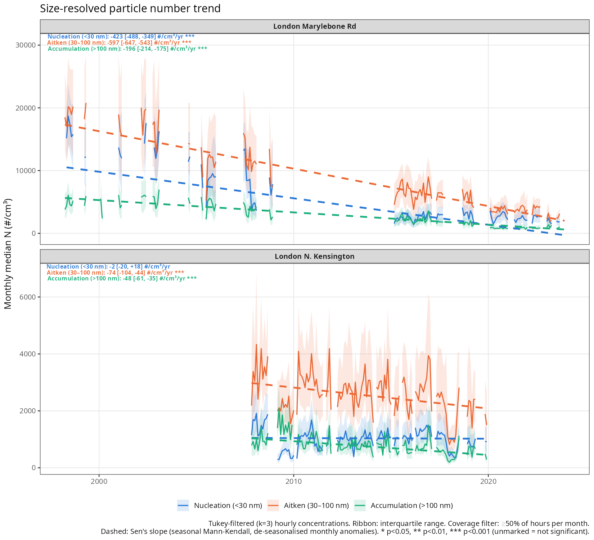

# UK Ultrafine Particle (UFP) Trends

Using publicly available CPC (condensation particle counter) and SMPS (scanning mobility particle sizer) data from long-term UK monitoring sites, this project is investigating long-term and short-term trends in ultrafine particle (UFP) number concentrations and size
distributions across the UK. Instrument data spans **1998–2025**, though temporal coverage varies per site. 15 sites were identified with CPC observations, six of which also have concurrent SMPS observations. The project harmonises six different instrument generations and data formats, and visualizes long-term trends, seasonal/diurnal structure, and individual
new-particle-formation (NPF) events. The figures and analysis below were developed with the assistance of Claude Code.


| Site | CPC record | SMPS record | Primary source(s) |
|---|---|---|---|
| Birmingham (BAQS) | 2022–2025 | 2022–2025, 61 bins, 10.4–777 nm | BAQS supersite |
| Manchester (MAQS) | 2019–2025 | 2019–2025, ~100 bins, 15–552 nm | MAQS supersite |
| London Marylebone Rd | 1998–2024 | 1998–2009, 2015–2023 (51→122 bins) | Defra PMP, AURN, UK-AIR |
| London Honor Oak Park | 2015–2024 | 2019–2023 (51→122 bins) | NPL, UK-AIR |
| London N. Kensington | 2000–2020 | 2007–2020, 51 bins, 16.6–604 nm | Defra PMP, UK-AIR |
| Harwell | 1998–2020 (gap 2015–20) | 1998–2009, 2015 (51 bins) | Defra PMP, AURN, UK-AIR |
| Chilbolton | 2015–2024 | 2020–2023 (51→122 bins) | NPL, UK-AIR |
| Bloomsbury, Belfast, Glasgow, Manchester PCC, Port Talbot, Tyburn, Lincoln, Birmingham City Centre | 2000–2020 (varies) | — | Defra PMP / AURN |

---

## Preliminary findings

**1. General decline in particle number concentrations.** Annual mean CPC concentration (using a Tukey filter to remove outliers) across all 15 monitored
sites show broad declines over the observational record: London Marylebone
Rd, a roadside monitoring site, falls from a peak of ~49,900 #/cm³ in 2001 to a 2020s baseline around
20,000 #/cm³. While the early Particle Monitoring Program (PMP) 2000s urban background sites (Bloomsbury, Manchester Piccadilly, Glasgow, Birmingham City Centre, Port Talbot) did not operate long enough to generate significant long-term trends on a per-site basis, particle concentrations generally ran higher (roughly 12,000–28,000 #/cm³) than the more recent instrument sites measured from 2019 onward (MAQS, HOP, BAQS,
Chilbolton), which cluster around 4,000–13,000 #/cm³. London Kensington, the longest running urban background monitoring site, is a potential throughline linking these two temporal periods, as its 2000-2008 observations are within 50% of the PMP sites, while its 2010-2018 dataset (~9,000 #/cm³) reflects the lower concentrations observed by the supersites (MAQS, BAQS, and HOP). However, further investigation would be required to definitively link trends at London Kensington to wider urban-background trends in the UK.  Rural background sites (Harwell, Chilbolton) have comparable observations with no obvious trend at either.  The behavior at Lincoln has not yet been investigated.


**2. Size-resolved decline is concentrated in the nucleation and Aitken size bands.**
At Marylebone Rd, Theil-Sen's slope trends (performed on
de-seasonalised monthly medians) show all three size bands declining
significantly: Aitken (30–100 nm) −597 [−647, −543], nucleation (<30 nm)
−423 [−488, −349], and accumulation (>100 nm) −196 [−214, −175] #/cm³/yr
(all p<0.001). Nucleation and Aitken size bins fall several times faster than the
accumulation band. The Aitken sizes also carry the widest month-to-month variability of
the three size bands, consistent with its concentration being shaped by episodic
new-particle-formation and growth events rather than a steady background.  Meanwhile,
at London N. Kensington, Aitken and accumulation size ranges decline significantly too
(−74 [−104, −44] and −48 [−61, −35] #/cm³/yr, both p<0.001), but nucleation
shows no significant trend (−2 [−20, +18] #/cm³/yr) over its 2007–2020
record, in contrast to Marylebone Rd. In any case, as it has been hypothesized that decreases in PM may increase concentrations of UFPs (i.e., lower concentrations of potential condensation sinks), the results from these sites require further investigation with consideration of concurrent PM2.5 and PM10 measurements, as well as chemical composition information where available.



**3. New-particle-formation events, classified day-by-day, show growth
rates of 0.5–5.6 nm/hr** The example below from London
Kensington, 23 May 2010 is a clear NPF event, showing growth
from ~21 nm to ~83 nm at 5.6 nm/hr over 8 traced hours (r² = 0.90).  Future work will identify NPF events at the operational supersites (MAQS, BAQS, and HOP) in order to understand current NPF frequencies and trends at urban background sites.


---

## Methods (summarised with assistance of Claude Code)

**Data harmonisation.** Six SMPS instrument generations (1998–2009 Defra PMP
TSI 3094 units, 2007+ NPL AURN instruments, the BAQS TSI-3082/3083
system, and the MAQS TSI-3750 system) report in different units, bin
structures, and file layouts. `read_smps_files()` detects source format by
column signature and header content, and converts dN-per-bin sources to the standardised
dN/d(log Dp) by dividing
by the per-bin Δlog(Dp) (`code/load_ufp.R`). Every site's spectrum is then
interpolated onto a common 64-bin log-spaced scale (10.37–964.66 nm) via
`smooth.spline` for cross-site comparison.

**Quality control.** A per-bin plausibility cap (10⁵ #/cm³/log(nm)) removes
raw instrument spikes before splining; a Tukey far-out fence (k=3) on the
resulting integrated hourly concentration removes what survives. Annual and
monthly summaries are only computed where hourly data coverage exceeds 25%
and 50% respectively, to exclude partial-period artefacts (e.g. a two-month
year read as a full year's mean).

**Trend statistics.** Long-term trends use Sen's slope with a seasonal
Mann-Kendall significance test on monthly values, after removing the
calendar-month climatological mean (de-seasonalising). This prevents the
annual cycle from inflating or masking the underlying slope. STL
decomposition (Cleveland et al., 1990; `s.window=13`, `robust=TRUE`)
separates trend from seasonal component on monthly series with data gaps
linearly interpolated across.

**Size-distribution modelling.** Multi-lognormal mode fitting
(`fit_lognormal_modes()`, an R port of PyNSD's fixed-3-seed deconvolution
method) decomposes each averaged spectrum into up to three log-normal modes
(seeded at 15/50/150 nm, σ∈[0.05,0.45]), fit via L-BFGS-B. Condensation sink,
coagulation sink, and formation rate (J) are computed following Kulmala et
al.'s standard aerosol-physics formulations, again ported from PyNSD.

**NPF classification.** Each candidate day is visually classified
(`NPF` / `Non-NPF` / `Undefined` / `Burst`) into a crash-safe CSV logbook —
one row written per day, so an interrupted session loses at most the day in
progress. For NPF days, a nucleation-mode growth window is hand-picked on the
size-distribution heatmap; the mode is then traced hour-by-hour and regressed
against time to give a growth rate. The picked window is saved, so the trace
and fit can be reproduced non-interactively at any time
(`npf_refit_logbook()`) — this is exactly the path `code/readme_figures.R`
uses to regenerate Figure 3 above without any manual clicking.

---

## Repository layout (summarised with assistance of Claude Code)

```
code/
  sourceMeFirst_ufp.R    entry point — sets paths, loads packages, sources the library files below
  load_ufp.R              core library: SMPS/CPC readers, unit conversion, splining, metrics, QC filters
  plot_ufp.R               library: banana/contour plots, lognormal overlay plots
  npf_ufp.R                 library: mode-finding, NPF pre-screening (Dal Masso et al. 2005 criteria)
  npf_physics.R              library: condensation sink, coagulation sink, formation rate (J)
  npf_classify.R              library + interactive tool: NPF logbook, day classification, growth-rate tracing
  prep_external.R              library: reformats data for PyNSD compatibility
  met_load.R                    library: AURN meteorological data for polar plots

  prepare_ukair_sites.R    driver: one-off harmonisation of raw AURN/NPL/Defra-PMP sources into per-site CSVs
  cpc-analysis.R            driver: all-site CPC overview, coverage audit, diurnal profiles
  trends-analysis.R          driver: long-term trend analysis — annual means, Theil-Sen, STL, modal fitting, size bands, climatologies
  smps-overview.R             driver: SMPS contour plots + per-site coverage summaries
  smps-diurnal.R                driver: seasonal diurnal profiles by size mode (BAQS/MAQS/HOP)
  smps-pnsd.R                    driver: seasonal median size distributions, all SMPS sites
  smps_site_comparison.R          driver: cross-era comparison for relocated-instrument site pairs
  npf-analysis.R                   driver: NPF classification + physics summary (interactive)
  cpc-polar-map.R                   driver: seasonal CPC-vs-wind polar plots
  ufp-polar-maps.R                   driver: seasonal CPC/SMPS-vs-wind polar plots, interactive Leaflet maps
  readme_figures.R                    generates the four figures embedded in this README

  beddows/                legacy scripts, not used by the active pipeline
  ufp-analysis.R           scratch pad
```

Scripts are designed to be run interactively in R, not as batch jobs — several
(`npf_classify.R`'s classification loop, `ufp-polar-maps.R`'s map building)
have genuinely interactive steps. `code/CLAUDE.md` has further data-format
detail per site.

---

## Reproducing the figures

```r
setwd("code")
source("readme_figures.R")
```

This regenerates the four PNGs in `figures/` from cached intermediate data
(`data/cache/*.Rds`). The
underlying **measurement data are not included in this repository** (volume,
and most of it is third-party redistributed data) — see the site table above
for original sources: Defra UK-AIR / AURN, the National Physical Laboratory
(NPL), the Defra Particle Measurement Programme (PMP), and the Birmingham
(BAQS) and Manchester (MAQS) supersites.

---

## Attribution

The NPF classification workflow, multi-lognormal mode fitting, and
condensation-sink / coagulation-sink / formation-rate physics
(`npf_ufp.R`, `npf_physics.R`, `npf_classify.R`) are an R port of James
Brean's [PyNSD](https://github.com/J-Brean/PyNSD), adapted to this project's
data structures. 
---

