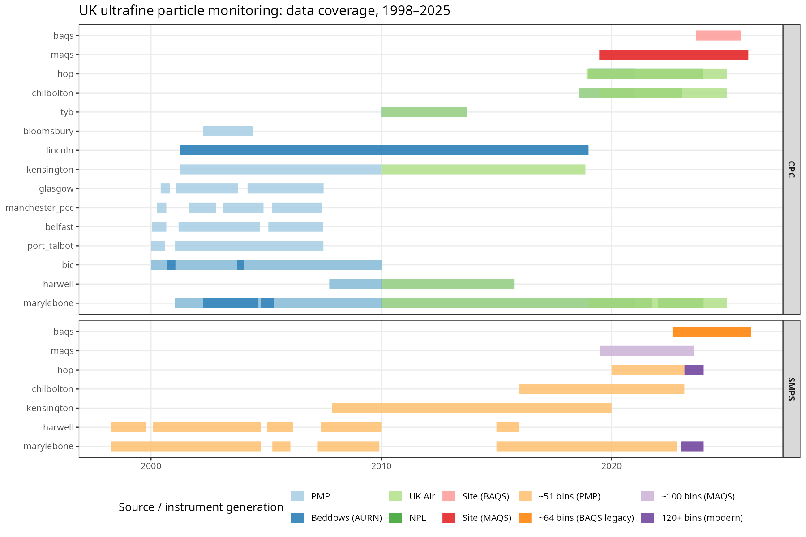
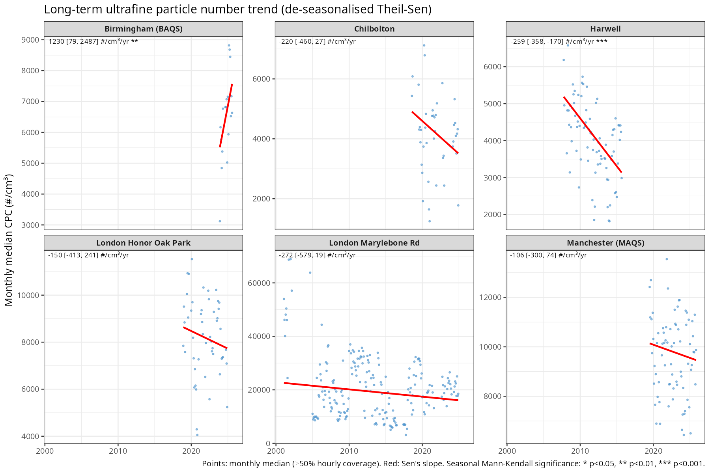
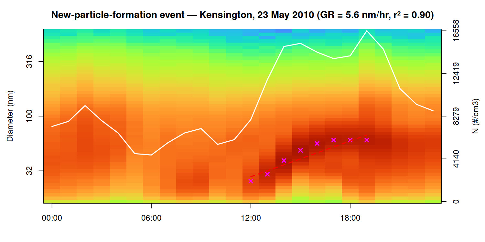

# UK Ultrafine Particle (UFP) Trends

A long-term analysis of ultrafine particle number concentrations and size
distributions at UK monitoring sites, built in R from raw CPC (condensation
particle counter) and SMPS (scanning mobility particle sizer) instrument
data spanning **1998–2025**: 15 sites with CPC-only records, 6 of them also
with concurrent SMPS size-distribution records. The project harmonises six
different instrument generations onto a common data model, then uses that to
look at long-term trends, seasonal/diurnal structure, and individual
new-particle-formation (NPF) events.



| Site | CPC record | SMPS record | Primary source(s) |
|---|---|---|---|
| Birmingham (BAQS) | 2022–2025 | 2022–2025, 61 bins, 10.4–777 nm | BAQS supersite |
| Manchester (MAQS) | 2019–2025 | 2019–2025, ~100 bins, 15–552 nm | MAQS supersite |
| London Marylebone Rd | 1998–2024 | 1998–2009, 2015–2023 (51→122 bins) | Defra PMP, Beddows AURN, UK-AIR |
| London Honor Oak Park | 2015–2024 | 2019–2023 (51→122 bins) | NPL, UK-AIR |
| London N. Kensington | 2000–2020 | 2007–2020, 51 bins, 16.6–604 nm | Defra PMP, UK-AIR |
| Harwell | 1998–2020 (gap 2015–20) | 1998–2009, 2015 (51 bins) | Defra PMP, Beddows AURN, UK-AIR |
| Chilbolton | 2015–2024 | 2020–2023 (51→122 bins) | NPL, UK-AIR |
| Bloomsbury, Belfast, Glasgow, Manchester PCC, Port Talbot, Tyburn, Lincoln, Birmingham City Centre | 2000–2020 (varies) | — | Defra PMP / Beddows AURN |

Full detail in `papers/analysis_summary.md`.

---

## Key findings

**1. Widespread multi-year decline in particle number, with one clear exception.**
De-seasonalised Theil-Sen trends (seasonal Mann-Kendall) on monthly median CPC
concentration show a statistically significant decline at Harwell
(−259 #/cm³/yr, p<0.001) and London Marylebone Rd (Marylebone falls from
peaks of 40,000–65,000 #/cm³ in the early 2000s to a 2020s baseline around
20,000 #/cm³, though its longer, noisier record only reaches p≈0.06). BAQS is
the exception: its short 2022–2025 record shows a significant *increase*
(+1,230 #/cm³/yr, p<0.01) — treated as provisional given only ~3 years of
data, not evidence of a genuine multi-year trend either way.



**2. Size-resolved decline is concentrated in the nucleation and Aitken bands.**
At Marylebone, where the record is long enough to resolve it, the decline
appears across nucleation (<30 nm), Aitken (30–100 nm), and accumulation
(>100 nm) bands, with the nucleation band showing the widest interquartile
range — consistent with its concentration being dominated by episodic
new-particle-formation events rather than a steady background.

**3. Typical fitted modal diameters** (multi-lognormal deconvolution, see
Methods): nucleation mode ~22–25 nm, Aitken mode ~37–58 nm, accumulation mode
~108–113 nm, fit quality r² ≈ 0.996–1.00 across sites.

**4. New-particle-formation events, classified day-by-day, show growth
rates of 0.5–5.6 nm/hr** across the 13 days with a fitted growth window in the
Kensington and BAQS logbooks (454 and 363 days classified respectively, of
which 12 are confirmed `NPF` and 1 `Undefined`). The example below —
Kensington, 23 May 2010 — is the clearest event in either logbook: growth
from ~21 nm to ~83 nm at 5.6 nm/hr over 8 traced hours (r² = 0.90), following
the classic mid-morning nucleation burst.



**5. Two site-level signals are flagged as likely instrument artefacts, not
environmental change** — worth stating plainly, since knowing which results
not to trust is as much a finding as the trends themselves:
- **Marylebone's Aitken mode** steps from ~45 nm (pre-2009 PMP instrument) to
  ~37 nm (post-2015 AURN instrument). STL decomposition of the modal-diameter
  series shows a sharp discontinuity exactly at the changeover, not a gradual
  drift, so this is treated as an instrument-generation artefact.
- **BAQS's nucleation mode** pins to ~10.4 nm, the instrument's lower bin
  edge, in most months — i.e. the true nucleation mode is frequently below
  the measurable range rather than genuinely sitting at 10 nm.

Two further items remain open and unresolved (see [Status](#status--open-issues)):
a post-2022 rise in MAQS concentrations across all size bands, and uncertain
absolute-unit calibration at Chilbolton.

---

## Methods

**Data harmonisation.** Six SMPS instrument generations (1998–2009 Defra PMP
TSI 3094 units, 2007+ Beddows/NPL AURN instruments, the BAQS TSI-3082/3083
system, and the MAQS TSI-3750 system) report in different units, bin
structures, and file layouts. `read_smps_files()` detects source format by
column signature and header content, and converts dN-per-bin sources to
dN/d(log Dp) — the unit every other source already reports in — by dividing
by the per-bin Δlog(Dp) (`code/load_ufp.R`). Every site's spectrum is then
interpolated onto a common 64-bin log-spaced scale (10.37–964.66 nm) via
`smooth.spline` for cross-site comparison.

**Quality control.** A per-bin plausibility cap (10⁵ #/cm³/log(nm)) removes
raw instrument spikes before splining; a Tukey far-out fence (k=3) on the
resulting integrated hourly concentration removes what survives. Annual and
monthly summaries are only computed where hourly data coverage exceeds 25%
and 50% respectively, to exclude partial-period artefacts (e.g. a two-month
year read as a full year's mean).

**Trend statistics.** Long-term trends use Sen's slope with a seasonal
Mann-Kendall significance test on monthly values, after removing the
calendar-month climatological mean (de-seasonalising) — this prevents the
annual cycle from inflating or masking the underlying slope. STL
decomposition (Cleveland et al., 1990; `s.window=13`, `robust=TRUE`)
separates trend from seasonal component on monthly series with data gaps
linearly interpolated across.

**Size-distribution modelling.** Multi-lognormal mode fitting
(`fit_lognormal_modes()`, an R port of PyNSD's fixed-3-seed deconvolution
method) decomposes each averaged spectrum into up to three log-normal modes
(seeded at 15/50/150 nm, σ∈[0.05,0.45]), fit via L-BFGS-B. Condensation sink,
coagulation sink, and formation rate (J) are computed following Kulmala et
al.'s standard aerosol-physics formulations, again ported from PyNSD.

**NPF classification.** Each candidate day is visually classified
(`NPF` / `Non-NPF` / `Undefined` / `Burst`) into a crash-safe CSV logbook —
one row written per day, so an interrupted session loses at most the day in
progress. For NPF days, a nucleation-mode growth window is hand-picked on the
size-distribution heatmap; the mode is then traced hour-by-hour and regressed
against time to give a growth rate. The picked window is saved, so the trace
and fit can be reproduced non-interactively at any time
(`npf_refit_logbook()`) — this is exactly the path `code/readme_figures.R`
uses to regenerate Figure 3 above without any manual clicking.

---

## Repository layout

```
code/
  sourceMeFirst_ufp.R    entry point — sets paths, loads packages, sources the library files below
  load_ufp.R              core library: SMPS/CPC readers, unit conversion, splining, metrics, QC filters
  plot_ufp.R               library: banana/contour plots, lognormal overlay plots
  npf_ufp.R                 library: mode-finding, NPF pre-screening (Dal Masso et al. 2005 criteria)
  npf_physics.R              library: condensation sink, coagulation sink, formation rate (J)
  npf_classify.R              library + interactive tool: NPF logbook, day classification, growth-rate tracing
  prep_external.R              library: reformats data for PyNSD compatibility
  met_load.R                    library: AURN meteorological data for polar plots

  prepare_ukair_sites.R    driver: one-off harmonisation of raw AURN/NPL/Beddows/Defra-PMP sources into per-site CSVs
  cpc-analysis.R            driver: all-site CPC overview, coverage audit, diurnal profiles
  trends-analysis.R          driver: long-term trend analysis — annual means, Theil-Sen, STL, modal fitting, size bands, climatologies
  smps-overview.R             driver: SMPS contour plots + per-site coverage summaries
  smps-diurnal.R                driver: seasonal diurnal profiles by size mode (BAQS/MAQS/HOP)
  smps-pnsd.R                    driver: seasonal median size distributions, all SMPS sites
  smps_site_comparison.R          driver: cross-era comparison for relocated-instrument site pairs
  npf-analysis.R                   driver: NPF classification + physics summary (interactive)
  cpc-polar-map.R                   driver: seasonal CPC-vs-wind polar plots
  ufp-polar-maps.R                   driver: seasonal CPC/SMPS-vs-wind polar plots, interactive Leaflet maps
  readme_figures.R                    generates the three figures embedded in this README

  beddows/                legacy scripts, not used by the active pipeline
  ufp-analysis.R           scratch pad
```

Scripts are designed to be run interactively in R, not as batch jobs — several
(`npf_classify.R`'s classification loop, `ufp-polar-maps.R`'s map building)
have genuinely interactive steps. `code/CLAUDE.md` has further data-format
detail per site.

---

## Reproducing the figures

```r
setwd("code")
source("readme_figures.R")
```

This regenerates the three PNGs in `figures/` from cached intermediate data
(`data/cache/*.Rds`) — a few seconds' runtime, no raw CSV re-parsing. The
underlying **measurement data are not included in this repository** (volume,
and most of it is third-party redistributed data) — see the site table above
for original sources: Defra UK-AIR / AURN, the National Physical Laboratory
(NPL), the Defra Particle Measurement Programme (PMP), and the Birmingham
(BAQS) and Manchester (MAQS) supersites.

---

## Attribution

The NPF classification workflow, multi-lognormal mode fitting, and
condensation-sink / coagulation-sink / formation-rate physics
(`npf_ufp.R`, `npf_physics.R`, `npf_classify.R`) are an R port of James
Brean's [PyNSD](https://github.com/J-Brean/PyNSD), adapted to this project's
data structures. Two deliberate departures from the PyNSD reference are
documented inline in `npf_physics.R`: the condensation-sink sign convention
(PyNSD's manual-panel code path is used, not its disagreeing
`physics/condensation.py`), and per-bin rather than single-scalar Δlog(Dp)
integration, since this project's bin widths are not perfectly uniform.

---

## Status / open issues

| Issue | Status |
|---|---|
| MAQS concentration rise from ~2022, all size bands | Unresolved — real source change or instrument artefact under investigation |
| Chilbolton SMPS absolute-unit calibration | Uncertain — diagnostic CPC-overlay comparison in place, not yet resolved |
| Fixed-3-seed mode fitting can split one broad mode into two spurious modes | Known limitation — mode-height plots preferred over diameter plots where this matters |
| STL trend/seasonal components across the Harwell/Marylebone 2010–2014 data gap | Linearly interpolated before decomposition — treat that stretch as modelled, not observed |
